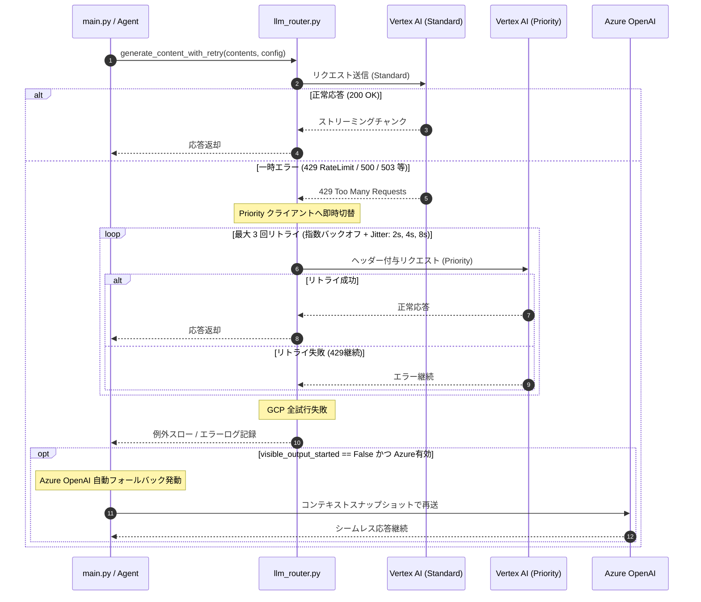
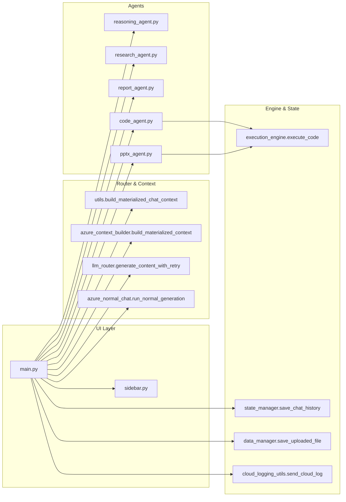

# GP-Chat 完全システム設計仕様書 (software-sheet.md)

本ドキュメントは、GCP (Vertex AI) および Azure OpenAI の大規模言語モデル（LLM）APIを統合・最適化した、StreamlitベースのAI駆動型統合ワークステーション「GP-Chat」の**完全システム設計仕様書**です。
本仕様書のみを参照することで、システムの全体アーキテクチャ、全30以上のモジュールの責務と公開インターフェース、関数間呼び出し関係（Call Graph）、データモデル/スキーマ定義、UI状態遷移と連動排他制御マトリクス、5大特化型自律エージェントの内部アルゴリズム（PowerPointネイティブ生成の4層パイプライン、幾何学バリデーション、自己修復ループ含む）、二重化ルーティングと障害耐性、コンテキスト構築パイプライン、全セッション状態変数、および例外処理方針を1行単位で完全に理解し、本システムをゼロから再実装・保守・拡張・デバッグできる詳細な設計情報を記述しています。

---

## 📑 目次 (Table of Contents)

1. [第1章: システム憲章 & 設計思想 (System Charter & Architecture Principles)](#第1章-システム憲章--設計思想-system-charter--architecture-principles)
2. [第2章: システムアーキテクチャ & ファイル・モジュール完全一覧 (System Architecture & Module Breakdown)](#第2章-システムアーキテクチャ--ファイルモジュール完全一覧-system-architecture--module-breakdown)
3. [第3章: データモデル & スキーマ完全リファレンス (Data Models & Schemas)](#第3章-データモデル--スキーマ完全リファレンス-data-models--schemas)
4. [第4章: セッション状態 (Session State) 変数 & クリーンアップ完全仕様 (Session State Management)](#第4章-セッション状態-session-state-変数--クリーンアップ完全仕様-session-state-management)
5. [第5章: UI / UX 状態遷移 & 画面制御ロジック (UI State Machine & Interaction Flows)](#第5章-ui--ux-状態遷移--画面制御ロジック-ui-state-machine--interaction-flows)
6. [第6章: コンテキスト構築 & マルチモーダルパースパイプライン (Context Materialization & Multimodal Parsing)](#第6章-コンテキスト構築--マルチモーダルパースパイプライン-context-materialization--multimodal-parsing)
7. [第7章: LLMルーティング・二重化 & 障害耐性仕様 (LLM Routing & Fault Tolerance)](#第7章-llmルーティング二重化--障害耐性仕様-llm-routing--fault-tolerance)
8. [第8章: 5大特化型エージェント完全内部アルゴリズム (Specialized Autonomous Agents)](#第8章-5大特化型エージェント完全内部アルゴリズム-specialized-autonomous-agents)
9. [第9章: Azure OpenAI 専用エージェント群仕様 (Azure Agent Implementations)](#第9章-azure-openai-専用エージェント群仕様-azure-agent-implementations)
10. [第10章: 関数間呼び出し関係 & シーケンス詳細 (Function Call Graphs & Sequence Diagrams)](#第10章-関数間呼び出し関係--シーケンス詳細-function-call-graphs--sequence-diagrams)
11. [第11章: 例外処理方針 & エラーハンドリングマトリクス (Exception Handling Matrix)](#第11章-例外処理方針--エラーハンドリングマトリクス-exception-handling-matrix)
12. [第12章: 設定ファイル & プロンプト定義完全仕様 (Configuration & Prompts)](#第12章-設定ファイル--プロンプト定義完全仕様-configuration--prompts)
13. [第13章: 改訂履歴 (Revision History)](#第13章-改訂履歴-revision-history)

---

## 第1章: システム憲章 & 設計思想 (System Charter & Architecture Principles)

### 1.1 システムの目的と開発思想
GP-Chat は、単一のAIモデルや単純なチャットUIの制約を克服し、実務における高度な意思決定、データ分析、コード開発、Webリサーチ、および高品質なプレゼンテーション資料作成を完全自律型で支援する「AI駆動型統合ワークステーション」です。

### 1.2 コア設計原則 (Core Architecture Principles)
1. **ハイブリッド＆ゼロダウンタイム (Hybrid & Zero Downtime)**:
   - GCP Vertex AI (Gemini) を主系とし、API レートリミット（429）や障害発生時には即座に Azure OpenAI へ自動フォールバックする。
   - 特定のコーディングモデル（`gpt-5.3-codex`, `gpt-5.6`）は最初から Azure への直接接続（GCPバイパス）を行い、最適なモデル適材適所を実現する。
2. **決定論的 UI 制御 & 厳格な排他ロック (Deterministic UI & Mutual Exclusion)**:
   - Streamlit の再実行（Rerun）モデルにおいて、競合するモード（例: 徹底調査とDeep Reasoning、PDFレポートとPPTXレポート）の同時選択をサイドバーの真理値マトリクスで完全に排他・連動ロックする。
3. **自己修復ループの標準化 (Self-Healing by Default)**:
   - Pythonコード実行エラー時の自動修正（Auto-Fix: 最大2回）および PowerPoint スライドの幾何学テキスト溢れ検知時の自動要約リライト（最大3回）を標準装備し、AI生成物の破綻を自律的に解消する。
4. **ステートレスなデータ変換とポインタ保護 (Stateless Parsing & Safe Pointer Management)**:
   - ファイルアップロード処理において、`temp_workspace/<Session-UUID>/` への隔離保存とファイルポインタ位置の保護（`seek(0)` / `tell()`）を徹底し、再実行時のデータ破損を防止する。
5. **完全な履歴可逆性 (History Reversibility & Branching)**:
   - 会話の任意の時点から分岐（Fork）して新しいチャットスレッドを開始できるツリー型対話を可能にし、試行錯誤の巻き戻しを完全に保証する。

---

## 第2章: システムアーキテクチャ & ファイル・モジュール完全一覧 (System Architecture & Module Breakdown)

### 2.1 リポジトリ全体構造ツリー

```text
gp-chat/
├── pyproject.toml              # パッケージビルド定義、依存パッケージメタデータ
├── requirements.txt            # ローカル環境用依存定義
├── mail.txt                    # ユーザーメールアドレス一時保存用
├── Plan.md                     # タスク計画・開発履歴ドキュメント
├── AICHANGELOG.md              # AIによる変更履歴（Before/After/理由/影響範囲）
├── CHANGELOG.md                # ユーザー向けリリースノート
├── LICENSE                     # Apache 2.0 ライセンス
├── START.bat                   # ワンクリック起動バッチ (Windows)
├── install.bat                 # 仮想環境セットアップ・依存更新バッチ
├── sample_of.env               # 環境変数設定サンプル
├── for_agent/
│   └── software-sheet.md       # 本システム設計仕様書
├── dev/
│   └── fault_injection.local.toml # 疑似エラー注入・フォールバック検証用設定
├── env/
│   └── *.env                   # 環境変数定義ファイル群（UI上で動的切替可能）
├── prompts/
│   └── prompts.yaml            # UI編集・永続化用システムプロンプト設定（カレント優先）
├── slide_data/
│   └── <チャットタイトル>/      # 生成されたHTML/PDF/PPTXスライドの格納ディレクトリ
├── chat_log/
│   └── *.json                  # 会話履歴の自動保存・分岐データ格納ディレクトリ
├── temp_workspace/
│   └── <Session-UUID>/         # セッション固有のデータファイル・画像一時保存領域
└── src/
    └── gp_chat/
        ├── __init__.py
        ├── main_runner.py      # CLIエントリーポイント (`gp-chat`)
        ├── main.py             # メインロジック（画面制御、セッション連携、ストリーミング）
        ├── sidebar.py          # サイドバーUI（モデル選択、モード切替、Canvas、履歴管理）
        ├── config.py           # 定数・UIテキスト・選択可能モデル定義
        ├── config.yaml         # Canvas許可拡張子等の静的設定
        ├── prompts.yaml        # デフォルトシステムプロンプト定義
        ├── utils.py            # ファイルパース、プロンプト読込、Geminiコンテキスト構築
        ├── state_manager.py    # 会話履歴の自動保存・復元、クリーンアップ、デバッグ収集
        ├── data_manager.py     # セッション別一時ファイル管理（ポインタ位置保護機能付き）
        ├── llm_router.py       # Vertex AI クライアント初期化、Standard/Priority切替、リトライ
        ├── execution_engine.py # ローカルPython実行、標準出力回収、matplotlibグラフキャプチャ
        ├── code_agent.py       # コード実行監視 & 自己修復ループ制御
        ├── reasoning_agent.py  # Deep Reasoning エージェント（立案・自己批判・統合）
        ├── research_agent.py   # ReAct 型自律反復検索エージェント
        ├── report_agent.py     # HTML/PDF レポート生成エージェント
        ├── pptx_agent.py       # PowerPoint ネイティブ生成 & 幾何学バリデーションエージェント
        ├── format.pptx         # PowerPoint スライド生成用デザインテンプレート
        ├── azure_runtime.py    # Azure OpenAI クライアント初期化 & ランタイム管理
        ├── azure_context_builder.py # Azure API 向けコンテキスト変換
        ├── azure_supervisor_helpers.py # GCPエラー検知 & Azure切替判定
        ├── azure_fault_injection.py # フォールバック検証用エラー注入
        ├── azure_common_types.py # Azure共通データ型定義
        ├── azure_history_utils.py # Azure用履歴変換ユーティリティ
        ├── azure_normal_chat.py # Azure用通常チャットハンドラ
        ├── azure_responses_router.py # Azure用レスポンスルーティング
        ├── azure_code_agent.py # Azure用コード実行・修復エージェント
        ├── azure_reasoning_agent.py # Azure用Deep Reasoningエージェント
        ├── azure_research_agent.py # Azure用徹底調査エージェント
        ├── azure_report_agent.py # Azure用レポート生成エージェント
        └── cloud_logging_utils.py # GCP Cloud Logging 送信ユーティリティ
```

### 2.2 全モジュール詳細仕様（関数シグネチャ・入出力・責務対照表）

#### ① `src/gp_chat/main_runner.py`
- **責務**: CLI コマンド `gp-chat` のエントリポイント。
- **主要関数**:
  - `run() -> None`: `sys.argv` を `["streamlit", "run", str(main_path)]` に再構築し、`streamlit.web.cli.main()` を呼び出してアプリを起動する。

#### ② `src/gp_chat/main.py`
- **責務**: アプリケーションのメインライフサイクル管理、UIレイアウト描画、チャット入力受付、ストリーミング応答制御、モデル別ルーティング分岐、Azure Fallback スーパーバイズ。
- **主要関数**:
  - `_resolve_mode_name(*, is_special_mode: bool, is_more_research: bool, is_deep_reasoning: bool, is_report_mode: bool) -> str`: 現在のUI状態から実行すべきモード識別名（`"report"`, `"research"`, `"reasoning"`, `"special"`, `"normal"`）を判定して返す。
  - `_run_azure_mode(...) -> AzureModeResult`: Azure OpenAI を使用して各種モード（Normal, Reasoning, Research, Report, Code）を実行する統合ディスパッチャ。
  - `main() -> None`: 初期セッション構築、メールアドレス入力ガード、システムプロンプト設定画面、サイドバー描画、履歴メッセージ描画、ユーザー入力処理、AI応答ストリーミング、Cloud Logging 送信、自動保存までを一括制御。

#### ③ `src/gp_chat/sidebar.py`
- **責務**: サイドバーUIコンポーネントの描画と設定変更ハンドリング、排他制御マトリクスの適用、Canvasエディタ描画、履歴JSONのロード/リセット。
- **主要関数**:
  - `render_sidebar(data_manager_instance) -> dict`: サイドバー全体を描画し、選択された設定値の辞書を返す。
  - `_render_environment_selector() -> None`: `env/` 配下の `.env` ファイル一覧を取得し、セレクトボックスを描画。
  - `_render_model_selector() -> None`: 利用可能なモデル一覧を描画し、選択値をセッションに同期。
  - `_render_thinking_level_selector(is_locked: bool) -> None`: `low` / `high` / `deep` の選択ラジオボタンを描画。
  - `_render_canvas_section(data_manager_instance) -> None`: 最大40スロットの Ace Editor、トグルボタン、Pylint検証ボタン、レビューボタンを描画。
  - `_render_history_section() -> None`: 過去の `chat_log/*.json` 一覧からの選択ロード、JSONファイルアップロード、および会話リセットボタンを描画。

#### ④ `src/gp_chat/config.py`
- **責務**: アプリケーション全体の定数定義、デフォルトセッションステート、UI文言定義。
- **主要定数・クラス**:
  - `MAX_CANVASES = 40`: 最大Canvasスロット数。
  - `EXECUTION_TIMEOUT = 30`: Pythonコード実行タイムアウト（秒）。
  - `LLM_RETRYABLE_STATUS_CODES = (408, 429, 500, 502, 503, 504)`: リトライ対象ステータスコード。
  - `PRIORITY_APP_RETRY_COUNT = 3`, `PRIORITY_APP_RETRY_WAIT_SECONDS = (2.0, 4.0, 8.0)`: リトライ設定。
  - `AVAILABLE_MODELS`: 選択可能なモデルIDのリスト。
  - `SESSION_STATE_DEFAULTS`: 初期 `st.session_state` 辞書。
  - `class UITexts`: UI上に表示する全静的テキストを管理するクラス。

#### ⑤ `src/gp_chat/utils.py`
- **責務**: ファイルのマルチモーダルパース、プロンプトYAMLのロード、Gemini API用の `types.Content` および `Part` リストの構築、OSクリップボードコピー連携。
- **主要関数**:
  - `copy_to_clipboard(text: str) -> bool`: Windows クリップボード (`win32clipboard`, `win32con.CF_UNICODETEXT`) を介して指定文字列を安全にコピー。
  - `load_prompts() -> dict`: `prompts/prompts.yaml`（不在時はパッケージ内デフォルト）をロードして辞書化。
  - `save_prompts(prompts: dict) -> None`: `prompts/prompts.yaml` にプロンプト設定を永続化。
  - `parse_file(uploaded_file) -> tuple[str, Any]`: アップロードファイル（画像, PDF, Word, Excel, PPT, テキスト）をパースし、`(mime_type, data)` を返す。
  - `_extract_docx(file_bytes: bytes) -> str`: `python-docx` で全段落テキストを抽出。
  - `_extract_excel(file_bytes: bytes, filename: str) -> str`: `python-calamine`（不在時 `openpyxl`）で全シートを読み込み、Markdown テーブル形式の文字列に変換。
  - `_convert_ppt_to_images_win32(file_bytes: bytes, filename: str) -> list[tuple[bytes, str]]`: Windows COM (`pywin32`) を使用して PowerPoint を起動し、全スライドを PNG 画像バイナリのリストとして抽出（キャッシュ機構付き）。
  - `build_materialized_chat_context(...) -> list[types.Content]`: 会話履歴、Canvasコードスニペット、添付ファイル Part をマージして Gemini 形式の完全なコンテキストを構築。

#### ⑥ `src/gp_chat/state_manager.py`
- **責務**: 会話履歴の永続化、手動ロード、セッション分岐、中断リカバリー、セッションクリーンアップ。
- **主要関数**:
  - `save_chat_history(messages, current_filename, total_usage, ...) -> str`: 会話履歴を `chat_log/yymmdd_タイトル.json` に保存。
  - `load_chat_history(filepath) -> dict`: JSONファイルを読み込み、セッションステートに展開可能な辞書を返す。
  - `fork_chat_history(messages, current_filename, target_index) -> tuple[str, list]`: 特定のメッセージ時点までの履歴を切り出し、連番ファイル名（`-02.json` 等）を採番して保存。
  - `check_interrupted_draft(messages, is_generating) -> str | None`: 未完了のユーザー入力を検知してドラフトテキストとして復元。
  - `cleanup_session_on_load(loaded_data) -> None`: 履歴ロード時の一時ウィジェットステート消去、添付キュー初期化、Canvas送信フラグの自動再構築。

#### ⑦ `src/gp_chat/data_manager.py`
- **責務**: セッションごとの一時作業ディレクトリ（`temp_workspace/<Session-UUID>/`）の作成・管理、アップロードファイルの保存とファイルポインタ保護。
- **主要関数・クラス**:
  - `class DataManager`: セッション管理クラス。
  - `save_uploaded_file(uploaded_file) -> str`: アップロードファイルを安全に一時ディレクトリに書き出し、ポインタ位置を元の位置にリストア（`seek(0)` / `tell()` 保護）。
  - `cleanup_temp_workspace() -> None`: セッション固有の一時ファイルを安全に一括削除。

#### ⑧ `src/gp_chat/llm_router.py`
- **責務**: Google GenAI SDK (`genai.Client`) の初期化、Standard / Priority クライアントの二重化制御、指数バックオフ＋Jitterリトライの実装。
- **主要関数**:
  - `get_gemini_client(route_type: str = "standard") -> genai.Client`: Standard（通常）または Priority（高負荷対策ヘッダー付き）のクライアントを取得。
  - `generate_content_with_retry(client, model, contents, config, stream=False) -> Any`: 429等のリトライ対象エラー検知時に Priority クライアントへ切り替え、指数バックオフ（2.0s, 4.0s, 8.0s + 0~1s Jitter）で最大3回リトライを実行するラッパー。

#### ⑨ `src/gp_chat/execution_engine.py`
- **責務**: ローカル環境スコープでの Python コードの安全な実行、標準出力・エラー出力のキャプチャ、matplotlib グラフ画像の回収。
- **主要関数**:
  - `execute_code(code_str: str, timeout: int = 30) -> tuple[str, list[str]]`: OSに応じた日本語フォント（Meiryo / Hiragino / Noto Sans）を動的に設定し、`matplotlib.use('Agg')` のもとで `exec()` を実行。標準出力文字列と Base64 エンコードされた PNG 画像のリストを返す。

#### ⑩ `src/gp_chat/code_agent.py`
- **責務**: AIが生成したコードブロックの実行監視、エラー（Traceback）検知、AIへの自己修復依頼ループ制御。
- **主要関数**:
  - `run_code_agent(...) -> tuple[str, list[str], dict]`: チャット応答内の ```python ... ``` ブロックを抽出し、`execution_engine` で実行。エラー発生時はエラーログをフィードバックして修正コードを要求（最大2回ループ）。

#### ⑪ `src/gp_chat/reasoning_agent.py`
- **責務**: Deep Reasoning モードのマルチターン思考パイプライン。
- **主要関数**:
  - `run_reasoning_agent(...) -> tuple[str, dict]`:
    1. Phase 1: 3アプローチ立案 (`temperature=0.4`, JSON出力)。
    2. Phase 2: 各アプローチへの厳格な自己批判 (`temperature=0.2`)。
    3. Phase 3: 自己批判をマージした最終結論ストリーミング統合 (`temperature=0.3`)。

#### ⑫ `src/gp_chat/research_agent.py`
- **責務**: 徹底調査（More Research）モードの ReAct 型自律反復検索ループ。
- **主要関数**:
  - `run_research_agent(...) -> tuple[str, dict]`:
    1. Dynamic Research ループ（最大3サイクル）: 情報十分性を JSON 判定 (`temperature=0.2`)。
    2. 不足時は提案クエリで Google 検索（Groundingツール）を実行し、事実を蓄積。
    3. Synthesis: 全収集事実を統合し、包括的レポートをストリーミング生成 (`temperature=0.3`)。

#### ⑬ `src/gp_chat/report_agent.py`
- **責務**: 会話履歴からのプレゼンテーション用 HTML スライド生成および Headless ブラウザによる PDF 自動エクスポート。
- **主要関数**:
  - `run_report_agent(...) -> tuple[str, str, dict]`: 会話履歴から A4横向きカードUI HTML を生成し、`slide_data/<フォルダ>/<連番>.html` に保存。
  - `_find_pdf_browser() -> str | None`: Edge / Chrome の実行ファイルパスを自動探索。
  - `_render_html_to_pdf(html_path: str, pdf_path: str) -> bool`: Headless ブラウザを `subprocess.run` で起動し、`--print-to-pdf` で PDF を保存。

#### ⑭ `src/gp_chat/pptx_agent.py`
- **責務**: PowerPoint ネイティブプレゼンテーション自動生成、Playwright幾何学バリデーション、AI画像自動生成/トリミング、Marp設計思想の適用、4層パイプラインの実行。
- **主要関数・クラス**:
  - `class PresentationDSLSchema`, `class SlideNode`, `class PlaceholderContent`, `class CropAreaSchema`: Pydantic スキーマ定義。
  - `run_pptx_agent(...) -> tuple[str, str, dict]`: 4層パイプラインを実行し、生成された `.pptx` ファイルパスとサマリーテキストを返す。
  - `_validate_and_fix_slide_overflow(...)`: Playwright (Chromium) でスライドモック HTML を描画し、スクロール溢れ (`scrollHeight > clientHeight`) を検知して Gemini で要約修復（最大3回ループ）。
  - `_generate_ai_image_with_imagen(...)`: `gemini-3.1-flash-lite-image` または `imagen-3.0-generate-002` を呼び出して 16:9 画像をオンデマンド生成（最大4枚）。
  - `_detect_bounding_box_and_crop(...)`: Gemini でバウンディングボックス相対座標（`CropAreaSchema`）を検出し、Pillow で物理トリミング。
  - `_render_slide_to_pptx(...)`: `python-pptx` を使用して `format.pptx` のプレースホルダーに流し込み描画（全30種以上の描画パーツ関数）。

#### ⑮ `src/gp_chat/azure_*.py` (Azure 専用モジュール群)
- **`azure_runtime.py`**: Azure OpenAI クライアント初期化とデプロイメント名管理。
- **`azure_context_builder.py`**: Gemini 形式コンテキストを Azure API 形式へ変換（画像 Base64 化、PDF 非対応例外スロー）。
- **`azure_supervisor_helpers.py`**: GCP のエラー状態やログを検査し、Azure へのフォールバック要否を判定。
- **`azure_fault_injection.py`**: `dev/fault_injection.local.toml` から疑似エラー設定をロードし、テスト用の 429 例外を注入。
- **`azure_common_types.py`**: `AzureModeResult`, `AzureUsageMetadata` などの共通データ型定義。
- **`azure_normal_chat.py`**: Azure を用いた通常チャットストリーミング。
- **`azure_reasoning_agent.py` / `azure_research_agent.py` / `azure_report_agent.py` / `azure_code_agent.py`**: 主系に対応する Azure 側の特化型エージェント実装。

#### ⑯ `src/gp_chat/cloud_logging_utils.py`
- **責務**: Google Cloud Logging への監査ログ送信。
- **主要関数**:
  - `send_cloud_log(user_email: str, model_id: str, prompt_text: str, response_text: str, usage_metadata: dict, ...) -> None`: GCP Cloud Logging に構造化ログを非同期送信。Azure 直接接続時やフォールバック時は 403 エラー防止のため自動スキップ。

---

## 第3章: データモデル & スキーマ完全リファレンス (Data Models & Schemas)

### 3.1 PowerPoint DSL スキーマ (`pptx_agent.py`)

```python
import pydantic
from typing import List, Literal, Optional

class CropAreaSchema(pydantic.BaseModel):
    """画像トリミング領域の相対座標 (0-1000スケール)"""
    ymin: int = pydantic.Field(..., description="切り出し領域の上端 (0-1000)")
    xmin: int = pydantic.Field(..., description="切り出し領域の左端 (0-1000)")
    ymax: int = pydantic.Field(..., description="切り出し領域の下端 (0-1000)")
    xmax: int = pydantic.Field(..., description="切り出し領域の右端 (0-1000)")

class PlaceholderContent(pydantic.BaseModel):
    """スライド内プレースホルダーへの流し込みデータ"""
    idx: int = pydantic.Field(..., description="テンプレート定義のプレースホルダーインデックス (0, 1, 2...)")
    text_content: Optional[str] = pydantic.Field(
        None,
        description="流し込むテキスト。箇条書きは先頭の '• ' を除き、改行 '\\n' で区切る。"
    )
    image_prompt: Optional[str] = pydantic.Field(
        None,
        description="IMAGE 枠の場合の AI 画像生成 (Imagen 3) 用英語プロンプト。"
    )
    use_user_image: bool = pydantic.Field(
        False,
        description="ユーザー添付画像を使用する場合は True。"
    )
    crop_instruction: Optional[str] = pydantic.Field(
        None,
        description="添付画像を使用する際のトリミング指示。"
    )

class SlideNode(pydantic.BaseModel):
    """1枚のスライドの論理構造"""
    slide_number: int = pydantic.Field(..., description="スライド番号 (1始まり)")
    title: str = pydantic.Field(..., description="スライドタイトル")
    layout_name: str = pydantic.Field(..., description="テンプレートから選択したスライドレイアウト名")
    placeholders: List[PlaceholderContent] = pydantic.Field(..., description="各プレースホルダーの流し込みデータ")
    visual_type: Literal["auto", "none", "summary", "timeline", "process", "comparison", "kpi", "matrix", "risk"] = "auto"
    visual_variant: str = "auto"
    color_theme: Literal["light", "dark", "corporate", "creative", "warm", "cool"] = pydantic.Field(
        "corporate",
        description="スライド全体のカラーデザインテーマ"
    )
    accent_color_hex: Optional[str] = pydantic.Field(
        None,
        description="キーポイント・KPI数値・強調矢印等に適用する16進数アクセントカラー (例: '#FF2A2A')"
    )
    coverage_refs: List[str] = pydantic.Field(
        default_factory=list,
        description="反映元のソース事実・要件リファレンス"
    )

class PresentationDSLSchema(pydantic.BaseModel):
    """プレゼンテーション全体の論理構成ルートスキーマ"""
    presentation_title: str = pydantic.Field(..., max_length=30, description="プレゼンテーション全体のタイトル")
    slides: List[SlideNode] = pydantic.Field(..., description="スライドのリスト")
```

### 3.2 Azure 共通データ型 (`azure_common_types.py`)

```python
from dataclasses import dataclass, field
from typing import Any, Dict, List, Optional

@dataclass
class AzureUsageMetadata:
    prompt_tokens: int = 0
    completion_tokens: int = 0
    total_tokens: int = 0

@dataclass
class AzureStreamChunk:
    text: str = ""
    is_final: bool = False
    usage: Optional[AzureUsageMetadata] = None

@dataclass
class AzureRouterResult:
    response_text: str = ""
    usage_metadata: Optional[AzureUsageMetadata] = None
    finish_reason: str = "stop"
    raw_response: Any = None

@dataclass
class AzureMaterializedContext:
    messages: List[Dict[str, Any]] = field(default_factory=list)
    system_instruction: str = ""
    has_image: bool = False
    has_unsupported_pdf: bool = False

@dataclass
class AzureModeResult:
    mode_name: str
    output_text: str
    usage_metadata: Optional[AzureUsageMetadata] = None
    artifacts: Dict[str, Any] = field(default_factory=dict)
    debug_logs: List[Dict[str, Any]] = field(default_factory=list)
```

### 3.3 会話履歴 JSON スキーマ (`chat_log/*.json`)

```json
{
  "system_role": "You are Gemini, a helpful and versatile AI assistant...",
  "current_model_id": "gemini-3.7-flash",
  "reasoning_effort": "high",
  "enable_google_search": true,
  "enable_more_research": false,
  "report_mode_pdf": false,
  "report_mode_pptx": false,
  "auto_plot_enabled": false,
  "total_usage": {
    "input_tokens": 1250,
    "output_tokens": 3400,
    "total_tokens": 4650
  },
  "messages": [
    {
      "role": "user",
      "content": "こんにちは。自己紹介をお願いします。"
    },
    {
      "role": "assistant",
      "content": "こんにちは！私はGP-Chatです...",
      "model_info": "gemini-3.7-flash",
      "usage_metadata": {
        "prompt_token_count": 120,
        "candidates_token_count": 350,
        "total_token_count": 470
      },
      "grounding_metadata": {
        "web_search_queries": ["..."]
      }
    }
  ],
  "python_canvases": [
    "# Canvas 1 code...\n",
    "# Canvas 2 code...\n"
  ],
  "canvas_enabled": [true, false]
}
```

---

## 第4章: セッション状態 (Session State) 変数 & クリーンアップ完全仕様 (Session State Management)

### 4.1 全 Session State 変数一覧リファレンス

| 変数名 | 型 | デフォルト値 | 変更契機 | 参照・利用モジュール |
| :--- | :---: | :--- | :--- | :--- |
| `messages` | `list[dict]` | `[]` | ユーザー送信、AIストリーミング完了、会話分岐 | `main.py`, `state_manager.py`, 全エージェント |
| `system_role_defined` | `bool` | `False` | 初回プロンプト確定ボタン押下 | `main.py`, `sidebar.py` |
| `current_model_id` | `str` | `gemini-3.7-flash` | サイドバーのモデル選択セレクトボックス | `main.py`, `sidebar.py`, `llm_router.py` |
| `reasoning_effort` | `str` | `high` | サイドバーの推論レベルラジオボタン | `main.py`, `reasoning_agent.py` |
| `enable_google_search` | `bool` | `True` | サイドバーの Web検索チェックボックス | `main.py`, `utils.py`, `research_agent.py` |
| `enable_more_research` | `bool` | `False` | サイドバーの徹底調査トグル | `main.py`, `sidebar.py`, `research_agent.py` |
| `report_mode_pdf` | `bool` | `False` | サイドバーの レポート機能(pdf) トグル | `main.py`, `sidebar.py`, `report_agent.py` |
| `report_mode_pptx` | `bool` | `False` | サイドバーの レポート機能(pptx) トグル | `main.py`, `sidebar.py`, `pptx_agent.py` |
| `auto_plot_enabled` | `bool` | `False` | サイドバーの グラフ描画・データ分析トグル | `main.py`, `code_agent.py` |
| `auto_save_enabled` | `bool` | `True` | サイドバーの自動保存トグル | `main.py`, `state_manager.py` |
| `python_canvases` | `list[str]` | `["# コードはここに \n"]` | Ace Editor への入力、ファイル読込、クリア | `sidebar.py`, `utils.py` |
| `canvas_enabled` | `list[bool]`| `[False]` | 各 Canvas の AI送信トグル、動的ON化 | `sidebar.py`, `utils.py` |
| `always_send_all_canvases`| `bool`| `False` | 全送信トグル切替 | `sidebar.py`, `state_manager.py` |
| `canvas_key_counter` | `int` | `0` | 履歴ロード時・フルリセット時にインクリメント | `sidebar.py`, `state_manager.py` |
| `toggle_keys` | `list[int]` | `[0]` | 個別 Canvas トグルリセット時にインクリメント | `sidebar.py`, `state_manager.py` |
| `uploaded_file_queue` | `list` | `[]` | ファイルアップローダーでのファイル選択/削除 | `sidebar.py`, `utils.py`, `data_manager.py` |
| `clipboard_queue` | `list` | `[]` | クリップボード貼付検知 | `sidebar.py`, `utils.py` |
| `current_chat_filename` | `str` | `None` | 初回保存時、履歴ロード時、分岐時 | `main.py`, `state_manager.py` |
| `current_report_folder` | `str` | `None` | レポート生成時、履歴ロード時 | `report_agent.py`, `pptx_agent.py` |
| `total_usage` | `dict` | `{"input_tokens": 0...}`| API応答完了時にトークン加算 | `main.py`, `state_manager.py` |
| `last_usage_info` | `dict` | `None` | 直近の API 呼び出し完了時 | `main.py` |
| `is_generating` | `bool` | `False` | 生成開始時に `True`、完了/エラー時に `False` | `main.py`, `sidebar.py` (UIロック) |
| `stop_generation` | `bool` | `False` | 停止ボタン押下時に `True` | `main.py`, ストリーミングループ |
| `debug_logs` | `list[dict]`| `[]` | APIリクエスト・レスポンス発生時 | `llm_router.py`, `main.py` |
| `_canvas_reset_pending` | `bool`| `False` | 履歴ロード直後にセット、次フレームで解除 | `sidebar.py` (巻き戻り防止) |

### 4.2 履歴ロード・リセット時の6段階クリーンアップアルゴリズム
`state_manager.cleanup_session_on_load()` は、セッション汚染による誤動作を完全に排除するため、以下の順序でクリーンアップを実行します。

```text
[履歴ロード / 会話リセットトリガー]
   │
   ├─ 1. 【キュー消去】: uploaded_file_queue = [], clipboard_queue = []
   ├─ 2. 【アップローダー初期化】: file_uploader_key += 1 (キャッシュ強制フラッシュ)
   ├─ 3. 【Canvas 送信フラグ再構築】:
   │       ├─ always_send_all_canvases == True  ──▶ 全 Canvas を True
   │       └─ always_send_all_canvases == False ──▶ 意味のあるコードが存在する Canvas のみ True
   ├─ 4. 【一時ウィジェットキー消去】:
   │       └─ session_state 内の ace_*, up_*, cvs_tog_* で始まる全キーを del
   ├─ 5. 【巻き戻り防止フラグセット】:
   │       ├─ _canvas_reset_pending = True
   │       └─ canvas_key_counter += 1, toggle_keys の各要素 += 1
   └─ 6. 【レポートフォルダ整合性確認】:
           └─ ロードデータに存在しない場合は current_report_folder = None
```

---

## 第5章: UI / UX 状態遷移 & 画面制御ロジック (UI State Machine & Interaction Flows)

### 5.1 サイドバー設定の連動・排他ロック制御マトリクス (真理値表)

| モード / 設定状態 | Thinking Level | Web検索 | 徹底調査 | レポート(pdf) | レポート(pptx) | auto_plot |
| :--- | :---: | :---: | :---: | :---: | :---: | :---: |
| **通常対話** | 任意選択 (`low`/`high`/`deep`) | 任意 (ON/OFF) | 選択可 | 選択可 | 選択可 | 任意 (ON/OFF) |
| **Thinking Level: deep** | `deep` (選択中) | 任意 (ON/OFF) | **ロック (選択不可)** | **ロック (選択不可)** | **ロック (選択不可)** | 任意 (ON/OFF) |
| **徹底調査 (More Research) ON** | **`high` に固定 (ロック)** | **強制 ON (ロック)** | ON (選択中) | **ロック (選択不可)** | **ロック (選択不可)** | 任意 (ON/OFF) |
| **レポート機能 (pdf) ON** | **`high` に固定 (ロック)** | 任意 (ON/OFF) | **ロック (選択不可)** | ON (選択中) | **ロック (選択不可)** | 任意 (ON/OFF) |
| **レポート機能 (pptx) ON** | **`high` に固定 (ロック)** | 任意 (ON/OFF) | **ロック (選択不可)** | **ロック (選択不可)** | ON (選択中) | 任意 (ON/OFF) |
| **生成中 (`is_generating=True`)** | **全設定ロック** | **全設定ロック** | **全設定ロック** | **全設定ロック** | **全設定ロック** | **全設定ロック** |

### 5.2 会話分岐（`✂️ この会話から分岐`）アルゴリズム
1. ユーザーが過去メッセージ $M_k$ の分岐ボタンを押下。
2. 履歴リストを先頭から $M_k$ までスライス: $\text{forked\_messages} = \text{messages}[0 : k+1]$。
3. 累積トークン数を $M_k$ までの合計値に再計算。
4. ファイル名の自動採番（`state_manager.fork_chat_history`）:
   - 元ファイル名が `260823_テーマ.json` の場合 ──▶ `260823_テーマ-02.json`
   - 既に `-02.json` が存在する場合は末尾インクリメント（`-03.json`, `-04.json`...）。
5. 新しいファイル名で保存し、`st.session_state.current_chat_filename` を更新して再実行（`st.rerun()`）。

### 5.3 Markdownコピー（`📋 Markdownをコピー`）仕様
1. **目的**: チャットプレビュー（リッチテキストレンダリング）表示されたAI応答から、元のMarkdown書式テキスト（raw Markdown）を忠実にクリップボードへ取得する。
2. **ボタン配置**: アシスタントメッセージ（`msg["role"] == "assistant"`）の下部アクション領域に、「✂️ この会話から分岐」ボタンと横並び（`st.columns([1, 1])`）で配置。生成中（`is_generating=True`）は非表示。
3. **コピー制御ロジック**:
   - `utils.copy_to_clipboard(msg["content"])` を呼び出し。
   - Windows API (`win32clipboard`, `win32con.CF_UNICODETEXT`) を介してUnicodeテキストをクリップボードに設定。
   - 成功時は `st.toast("📋 クリップボードにMarkdownをコピーしました", icon="✅")` をポップアップ表示。
   - 空文字または例外発生時はエラーハンドリングを行い、UIのクラッシュを防止。

---

## 第6章: コンテキスト構築 & マルチモーダルパースパイプライン (Context Materialization & Multimodal Parsing)

### 6.1 各ファイル形式のパース処理詳細

```text
[アップロードファイル]
   │
   ├── 画像形式 (.png, .jpg, .jpeg, .gif, .bmp)
   │    ├─ GCP Vertex AI : types.Part.from_bytes(data=bytes, mime_type=mime)
   │    └─ Azure OpenAI  : data:image/{mime};base64,{base64_str}
   │
   ├── PDF (.pdf)
   │    ├─ GCP Vertex AI : types.Part.from_bytes(data=bytes, mime_type="application/pdf")
   │    └─ Azure OpenAI  : AzureContextBuildError 例外スロー (フォールバック抑止)
   │
   ├── Word (.docx)
   │    └─ python-docx で全段落抽出 ──▶ "[Attached Document: filename]\n" + text
   │
   ├── Excel (.xlsx, .xlsm, .xls)
   │    ├─ python-calamine (高速Rustエンジン) で全シート走査
   │    ├─ pandas.DataFrame.to_markdown() で Markdown テーブル化
   │    └─ "### Sheet: {sheet_name}\n" + table_markdown
   │
   ├── PowerPoint (.ppt, .pptx)
   │    ├─ Windows COM (pywin32) バックグラウンド起動 (POWERPNT.EXE)
   │    ├─ ppSaveAsPNG (18) で各スライドを PNG 抽出
   │    ├─ ハッシュ値による ppt_conversion_cache キャッシュ保存
   │    └─ 各スライド PNG を画像 Part として送信
   │
   └── テキスト / ソースコード (.py, .js, .md, .txt, .json, .csv, .yaml 等)
        ├─ UTF-8 デコード試行
        ├─ 失敗時: CP932 (Shift-JIS) デコード試行
        └─ 失敗時: errors="replace" で文字化け許容デコード ──▶ ```{ext}\n{text}\n```
```

### 6.2 Canvas コードのプロンプトインジェクション仕様
有効な Canvas のコードは、ユーザーメッセージのテキストの**先頭**に以下のフォーマットで注入されます。

```text
[Canvas-1]
```python
# Canvas 1 のコード
import pandas as pd
...
```

[Canvas-3]
```python
# Canvas 3 のコード
def calculate():
    pass
```

ユーザーの入力メッセージテキスト...
```

---

## 第7章: LLMルーティング・二重化 & 障害耐性仕様 (LLM Routing & Fault Tolerance)

### 7.1 二重化クライアント制御フロー (`llm_router.py`)



---

## 第8章: 5大特化型エージェント完全内部アルゴリズム (Specialized Autonomous Agents)

### 8.1 Deep Reasoning（思考レベル: deep）
- **Brainstorming フェーズ**: `temperature=0.4`, `response_mime_type="application/json"` を指定し、3つの異なるアプローチを立案。
- **Critique フェーズ**: `temperature=0.2` で、各アプローチの論理的欠陥・エッジケース破綻をあえて批判。
- **Integration フェーズ**: 自己批判を `synthesis_instruction` に埋め込み、`temperature=0.3` で最終解をストリーミング合成。

### 8.2 More Research（徹底調査モード）
- **Dynamic Research ループ**: 最大3サイクル。サイクルごとに情報十分性を JSON 判定（`temperature=0.2`）。不足時は提案クエリで Google 検索（Grounding ツール）を実行し、事実情報を蓄積。
- **Synthesis フェーズ**: 全事実を「一次情報優先ルール」とともに統合し、`temperature=0.3` で最終レポートを出力。

### 8.3 Auto-Plot（データ分析・グラフ描画 & 自己修復）
- **コード実行**: 応答内の Python コードを抽出し、OS別フォントを設定したローカルスコープで `exec()`。matplotlib Agg バックエンドで Figure を回収し Base64 インライン表示。
- **自己修復**: `Traceback` 発生時はエラーログをフィードバックして修正コードを要求（最大2回反復）。

### 8.4 Report PDF（HTML/PDF スライド自動生成）
- **HTML 生成**: `prompts.yaml` の `report_pdf` テンプレートに基づき、A4横カードUI HTML を生成。
- **PDF 変換**: ローカルの Edge/Chrome を探索し、`--headless=new --print-to-pdf --virtual-time-budget=5000` で高精度印刷保存。

### 8.5 Report PPTX（PowerPoint ネイティブ生成 4層パイプライン）

```text
【第1層: 構造化 JSON 生成】 (temperature=0.2)
   ├─ PresentationDSLSchema (タイトル, 各スライドノード, color_theme, accent_color_hex)
   └─ format.pptx のレイアウト・プレースホルダー idx 動的マッピング
   │
   ▼
【第2層 & 第3層: 幾何学バリデーション & 要約自己修復】
   ├─ HTMLモック生成 ──▶ Playwright (Chromium headless) レンダリング
   ├─ スクロール溢れ判定 (scrollHeight > clientHeight)
   ├─ 溢れ検出時: Gemini (gemini-3.5-flash) で文字数を 30~50% 削減要約リライト (最大3回)
   └─ ループ上限時フォールバック: フォントサイズ -2pt 強制縮小
   │
   ▼
【画像処理パイプライン】
   ├─ AI画像生成: gemini-3.1-flash-lite-image / imagen-3 (最大4枚)
   └─ 添付画像トリミング: Gemini でバウンディングボックス検知 (CropAreaSchema) ──▶ Pillow トリミング
   │
   ▼
【第4層: 物理 PPTX 生成 & テンプレート後処理】
   ├─ python-pptx でプレースホルダー idx にコンテンツ流し込み
   ├─ 未使用プレースホルダー自動削除
   └─ 表紙タイトル書換、2枚目見本スライド削除、裏表紙の最末尾移動
```

---

## 第9章: Azure OpenAI 専用エージェント群仕様 (Azure Agent Implementations)

| モジュール名 | 役割・対応機能 |
| :--- | :--- |
| `azure_normal_chat.py` | 通常チャットストリーミングおよび Special モードストリーミング。 |
| `azure_reasoning_agent.py` | Azure OpenAI を用いた 3 段階 Deep Reasoning パイプライン。 |
| `azure_research_agent.py` | Azure OpenAI を用いた ReAct 型徹底調査ループ。 |
| `azure_report_agent.py` | Azure OpenAI を用いた HTML プレゼン生成 & PDF 印刷。 |
| `azure_code_agent.py` | Azure OpenAI を用いた Python コード自動実行 & 自己修復ループ。 |

---

## 第10章: 関数間呼び出し関係 & シーケンス詳細 (Function Call Graphs & Sequence Diagrams)



---

## 第11章: 例外処理方針 & エラーハンドリングマトリクス (Exception Handling Matrix)

| 発生例外 / エラー種別 | 発生箇所 | システムの回復アクション | ユーザーへの通知 |
| :--- | :--- | :--- | :--- |
| **`429 Rate Limit (Vertex AI)`** | `llm_router.py` | Priorityクライアント切替 → 指数バックオフトライ → Azure Fallback | トースト警告 / Azure切替表示 |
| **`AzureContextBuildError`** | `azure_context_builder.py`| PDF添付時等、Azure非対応コンテキストを検知しフォールバック抑止 | UIにGCPエラーをそのまま通知 |
| **`Python Execution Syntax/Runtime Error`**| `execution_engine.py` | TracebackをAIにフィードバックし自己修復ループ（最大2回） | 修復中スピナー / 最終エラー表示 |
| **`Playwright Overflow Error`** | `pptx_agent.py` | 文字数30~50%削減要約リライト（最大3回） → フォント-2pt縮小 | スライド自動調整中メッセージ |
| **`PowerPoint COM Error`** | `utils.py` | プロセス強制クリーンアップ、テキストのみ抽出フォールバック | 警告メッセージ表示 |
| **`mail.txt 未設定 / 不正`** | `main.py` | アプリ操作をブロックし、メールアドレス入力画面を表示 | 入力フォーム表示 |

---

## 第12章: 設定ファイル & プロンプト定義完全仕様 (Configuration & Prompts)

- **`prompts/prompts.yaml`**:
  - `default_system_prompt`: 汎用AIアシスタントプロンプト。
  - `engineer`: エンジニア特化型プロンプト。
  - `translator`: 翻訳アシスタントプロンプト。
  - `report_pdf`: A4横カードUI HTMLスライド生成用テンプレートプロンプト。
  - `pptx_system_instruction`: Marp設計思想を統合したPowerPointスライド生成プロンプト。
- **`config.yaml`**:
  - Canvasへのファイル読込で許可する拡張子リスト（`.py`, `.js`, `.md`, `.txt`, `.yaml`, `.json` 等）。
- **`sample_of.env`**:
  - GCP、Vertex AI、Azure OpenAI、Cloud Logging の全設定パラメータ定義。

---

## 第13章: 改訂履歴 (Revision History)

* **2026-09-05**
  * `pyproject.toml` の依存定義修正: OpenAI Python SDK 3.0.0（HTTPX2移行）による破壊的変更からシステムを保護するため、依存定義を `openai>=2.45.0, <3.0.0` に厳格化。
* **2026-08-23**
  * チャット画面のUI改修: 各AI返答メッセージ下部に「📋 Markdownをコピー」ボタンを追加。`utils.copy_to_clipboard`（Windows `win32clipboard` による Unicode コピー）および `st.toast` 通知との連携仕様を策定・実装。
* **2026-08-23**
  * システム全体を1行単位で完全に把握・再構築・保守・拡張できる「完全システム設計仕様書（全13章・超詳細版）」として全面刷新・拡充。全モジュール責務対照表、Pydantic/Azureスキーマ、UI制御真理値表、関数間Call Graph、例外処理マトリクスを完全統合。
* **2026-07-05**
  * PowerPointネイティブ生成機能（Report PPTX）において、Marp用の `SKILL.md` のデザイン設計思想を統合。One idea per slide原則、リストの最大6行制限、データの強調を主としたカラーデザイン階層化（`color_theme`、`accent_color_hex`の動的制御）、および枠線廃止による共通描画パーツのフラットモダン化を実施。
* **2026-07-05**
  * PowerPointレポート自動生成において、スライドの創造性向上のため `gemini-3.1-flash-lite-image` を用いたAI画像生成の積極的活用（目安枚数を最大4枚程度へ引き上げ、概念図やアイコンビジュアルの生成を促進）を行うようプロンプト指示を調整。
* **2026-07-04**
  * 最新の PowerPoint ネイティブ生成機能（`pptx_agent.py`, `format.pptx` 等）の導入に伴い、ファイル構成ツリー、主要な依存パッケージ（`python-pptx`, `playwright`）、サイドバー UI の排他・連動ロック仕様（pdf / pptx の分割）、および Report PPTX 特化エージェントの4層パイプライン動作詳細アルゴリズムを追記。
* **2026-07-04**
  * システム全体を完全に再構築可能なレベル（パッケージ構成、UIレイアウト、状態制御マトリクス、エージェントアルゴリズム、コンテキスト構築、ルーティング・高可用性仕様、セッション管理とクリーンアップ処理フロー）に仕様書の記述を大幅に拡充・詳細化。
* **2026-06-13**
  * 会話履歴読み込み時のセッションクリーンアップ処理（添付キュー・一時ウィジェットキーの削除、送信フラグの自動再構築）の仕様を追記。
* **2026-06-06**
  * システムプロンプト上書き確認ダイアログ (`st.dialog`)、プロンプト保存永続化先変更、マルチコードの常時有効化に伴う UI 変更（マルチコードトグルの廃止）の仕様を追記。
* **2026-05-23**
  * `gpt-5.3-codex` 直接接続（GCPバイパス）機能、Azure 使用時の GCP Cloud Logging 抑止、環境変数 `AZURE_OPENAI_CODEX_DEPLOYMENT` に関する仕様を追記。

